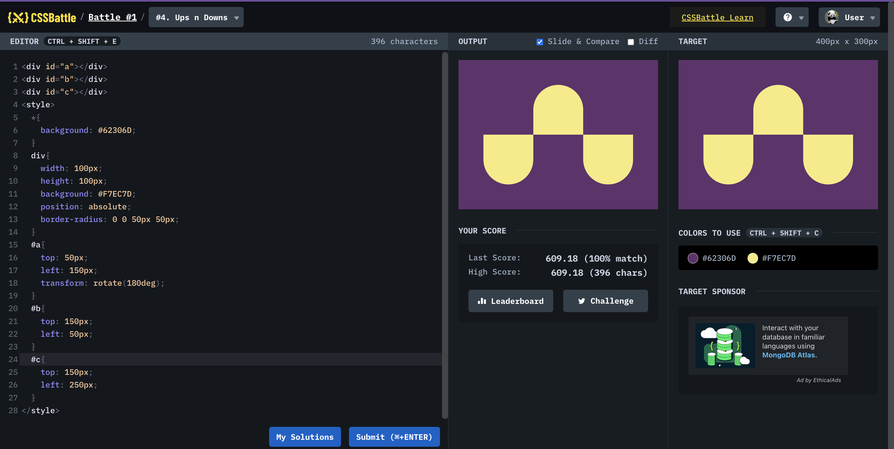

# Battle #1 - Pilot Battle

## #4 - Ups n Downs

[Link to the problem](https://cssbattle.dev/play/4)



```html
<div id="a"></div>
<div id="b"></div>
<div id="c"></div>
<style>
  * {
    background: #62306d;
  }
  div {
    width: 100px;
    height: 100px;
    background: #f7ec7d;
    position: absolute;
    border-radius: 0 0 50px 50px;
  }
  #a {
    top: 50px;
    left: 150px;
    transform: rotate(180deg);
  }
  #b {
    top: 150px;
    left: 50px;
  }
  #c {
    top: 150px;
    left: 250px;
  }
</style>
```
