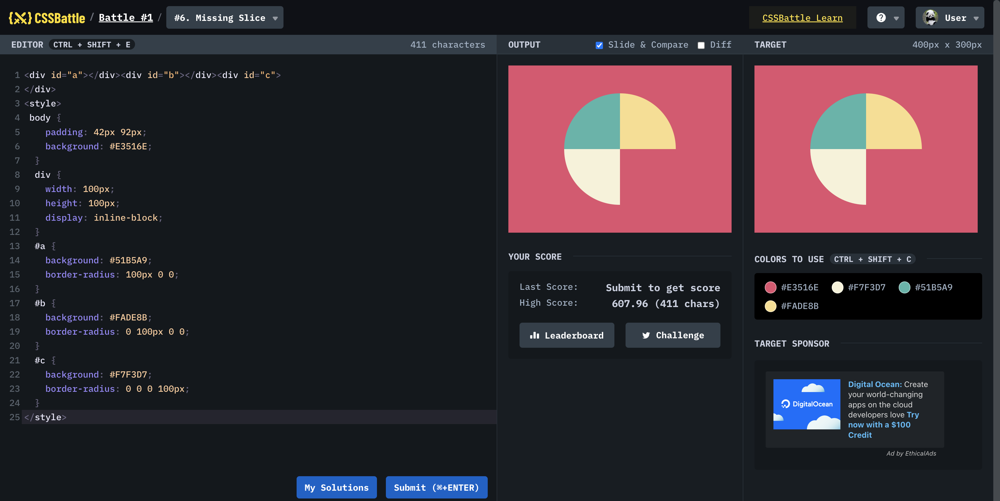

# Battle #1 - Pilot Battle

## #5 - Missing Slice

[Link to the problem](https://cssbattle.dev/play/6)



```html
<div id="a"></div>
<div id="b"></div>
<div id="c"></div>
<style>
  body {
    padding: 42px 92px;
    background: #e3516e;
  }
  div {
    width: 100px;
    height: 100px;
    display: inline-block;
  }
  #a {
    background: #51b5a9;
    border-radius: 100px 0 0;
  }
  #b {
    background: #fade8b;
    border-radius: 0 100px 0 0;
  }
  #c {
    background: #f7f3d7;
    border-radius: 0 0 0 100px;
  }
</style>
```
