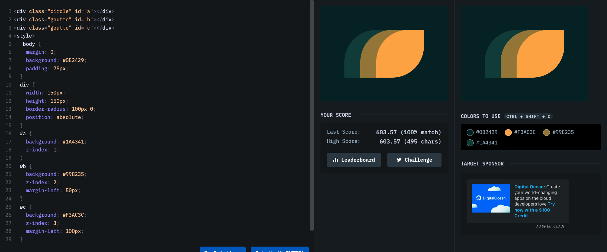

# Battle #1 - Pilot Battle

## #7 - Leafy Trail

[Link to the problem](https://cssbattle.dev/play/7)



```html
<div class="circle" id="a"></div>
<div class="goutte" id="b"></div>
<div class="goutte" id="c"></div>
<style>
  body {
    margin: 0;
    background: #0b2429;
    padding: 75px;
  }
  div {
    width: 150px;
    height: 150px;
    border-radius: 100px 0;
    position: absolute;
  }
  #a {
    background: #1a4341;
    z-index: 1;
  }
  #b {
    background: #998235;
    z-index: 2;
    margin-left: 50px;
  }
  #c {
    background: #f3ac3c;
    z-index: 3;
    margin-left: 100px;
  }
</style>
```
