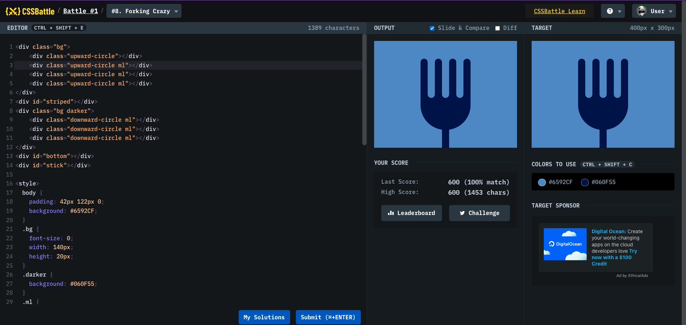

# Battle #1 - Pilot Battle

## #8 - Forking Crazy

[Link to the problem](https://cssbattle.dev/play/8)



```html
<div class="bg">
  <div class="upward-circle"></div>
  <div class="upward-circle ml"></div>
  <div class="upward-circle ml"></div>
  <div class="upward-circle ml"></div>
</div>
<div id="striped"></div>
<div class="bg darker">
  <div class="downward-circle ml"></div>
  <div class="downward-circle ml"></div>
  <div class="downward-circle ml"></div>
</div>
<div id="bottom"></div>
<div id="stick"></div>

<style>
  body {
    padding: 42px 122px 0;
    background: #6592cf;
  }
  .bg {
    font-size: 0;
    width: 140px;
    height: 20px;
  }
  .darker {
    background: #060f55;
  }
  .ml {
    margin-left: 20px;
  }
  #striped {
    width: 140px;
    height: 70px;
    background: repeating-linear-gradient(
      to left,
      #060f55 0px,
      #060f55 20px,
      #6592cf 20px,
      #6592cf 40px
    );
  }
  #bottom {
    width: 140px;
    height: 90px;
    background: #060f55;
    border-radius: 0 0 100px 100px;
  }
  .upward-circle {
    width: 20px;
    height: 20px;
    background: #060f55;
    border-radius: 20px 20px 0 0;
    display: inline-block;
  }
  .downward-circle {
    width: 20px;
    height: 20px;
    background: #6592cf;
    border-radius: 0 0 20px 20px;
    display: inline-block;
  }
  #stick {
    width: 20px;
    height: 60px;
    z-index: 1;
    position: relative;
    top: -10px;
    background: #060f55;
    margin-left: 60px;
  }
</style>
```
