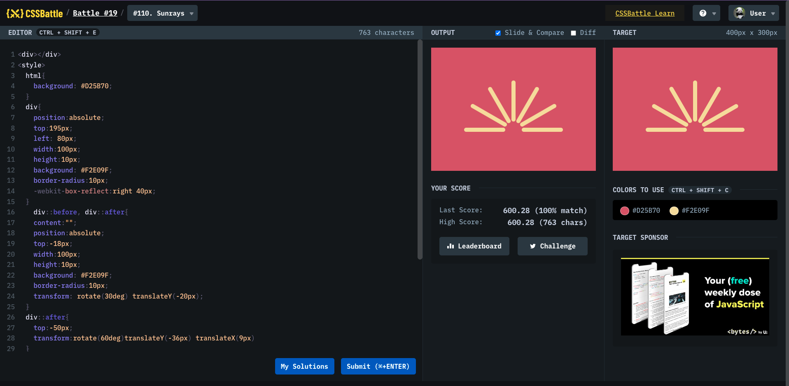

# Battle #19 - Spacing

## #110 - Wiggly Moustache

[Link to the problem](https://cssbattle.dev/play/110)



```html
<div></div>
<style>
  html {
    background: #d25b70;
  }
  div {
    position: absolute;
    top: 195px;
    left: 80px;
    width: 100px;
    height: 10px;
    background: #f2e09f;
    border-radius: 10px;
    -webkit-box-reflect: right 40px;
  }
  div::before,
  div::after {
    content: "";
    position: absolute;
    top: -18px;
    width: 100px;
    height: 10px;
    background: #f2e09f;
    border-radius: 10px;
    transform: rotate(30deg) translateY(-20px);
  }
  div::after {
    top: -50px;
    transform: rotate(60deg) translateY(-36px) translateX(9px);
  }
  html::before {
    content: "";
    position: absolute;
    top: 125px;
    left: 150px;
    width: 100px;
    height: 10px;
    background: #f2e09f;
    border-radius: 10px;
    transform: rotate(90deg);
  }
</style>
```
