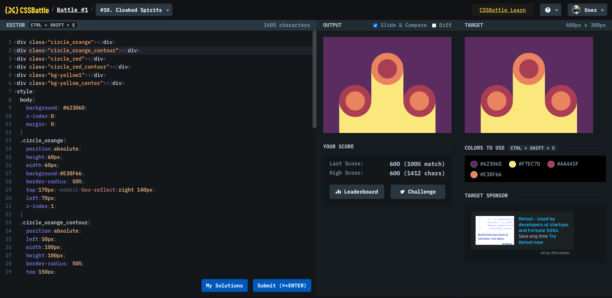

# Battle #1 - Pilot Battle

## #10 - Cloaked Spirits

[Link to the problem](https://cssbattle.dev/play/10)



```html
<div class="circle_orange"></div>
<div class="circle_orange_contour"></div>
<div class="circle_red"></div>
<div class="circle_red_contour"></div>
<div class="bg-yellow1"></div>
<div class="bg-yellow_center"></div>
<style>
  body {
    background: #62306d;
    z-index: 0;
    margin: 0;
  }
  .circle_orange {
    position: absolute;
    height: 60px;
    width: 60px;
    background: #e38f66;
    border-radius: 50%;
    top: 170px;
    -webkit-box-reflect: right 140px;
    left: 70px;
    z-index: 1;
  }
  .circle_orange_contour {
    position: absolute;
    left: 50px;
    width: 100px;
    height: 100px;
    border-radius: 50%;
    top: 150px;
    -webkit-box-reflect: right 100px;
    background: #aa445f;
    z-index: 0;
  }
  .circle_red {
    position: absolute;
    height: 60px;
    width: 60px;
    background: #aa445f;
    border-radius: 50%;
    top: 70px;
    left: 170px;
    z-index: 2;
  }
  .circle_red_contour {
    position: absolute;
    left: 150px;
    width: 100px;
    height: 100px;
    border-radius: 50%;
    top: 50px;
    background: #e38f66;
    z-index: 0;
  }
  .bg-yellow1 {
    position: absolute;
    height: 100px;
    width: 100px;
    background: #f7ec7d;
    top: 200px;
    -webkit-box-reflect: right 100px;
    left: 50px;
    z-index: -1;
  }
  .bg-yellow_center {
    position: absolute;
    height: 200px;
    width: 100px;
    background: #f7ec7d;
    top: 100px;
    left: 150px;
    z-index: -1;
  }
</style>
```
