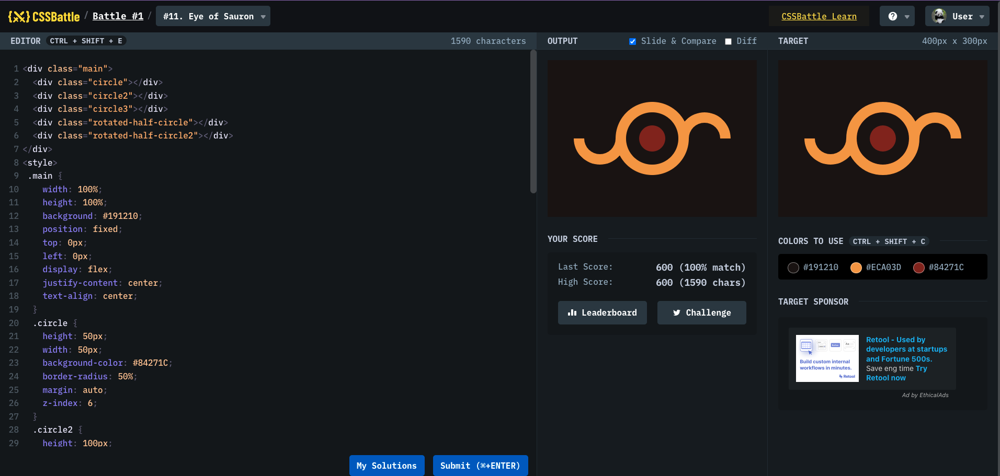

# Battle #1 - Pilot Battle

## #11 - Eye of Sauron

[Link to the problem](https://cssbattle.dev/play/11)



```html
<div class="main">
  <div class="circle"></div>
  <div class="circle2"></div>
  <div class="circle3"></div>
  <div class="rotated-half-circle"></div>
  <div class="rotated-half-circle2"></div>
</div>
<style>
  .main {
    width: 100%;
    height: 100%;
    background: #191210;
    position: fixed;
    top: 0px;
    left: 0px;
    display: flex;
    justify-content: center;
    text-align: center;
  }
  .circle {
    height: 50px;
    width: 50px;
    background-color: #84271c;
    border-radius: 50%;
    margin: auto;
    z-index: 6;
  }
  .circle2 {
    height: 100px;
    width: 100px;
    background-color: #191210;
    border-radius: 50%;
    margin: auto;
    z-index: 5;
    position: absolute;
    top: 100px;
  }
  .circle3 {
    height: 140px;
    width: 140px;
    background-color: #eca03d;
    border-radius: 50%;
    margin: auto;
    z-index: 4;
    position: absolute;
    top: 80px;
  }
  .rectangle {
    z-index: 1;
    background-color: #243d83;
    height: 150px;
    width: 300px;
    position: absolute;
    margin: auto;
    top: 75px;
  }
  .rotated-half-circle {
    position: absolute;
    width: 60px;
    height: 60px;
    left: 50px;
    top: 100px;
    border: 20px solid #eca03d;
    border-radius: 100%;
    border-bottom-color: transparent;
    border-left-color: transparent;
    transform: rotate(135deg);
  }
  .rotated-half-circle2 {
    position: absolute;
    width: 60px;
    height: 60px;
    left: 250px;
    top: 100px;
    border: 20px solid #eca03d;
    border-radius: 100%;
    border-bottom-color: transparent;
    border-left-color: transparent;
    transform: rotate(315deg);
  }
</style>
```
