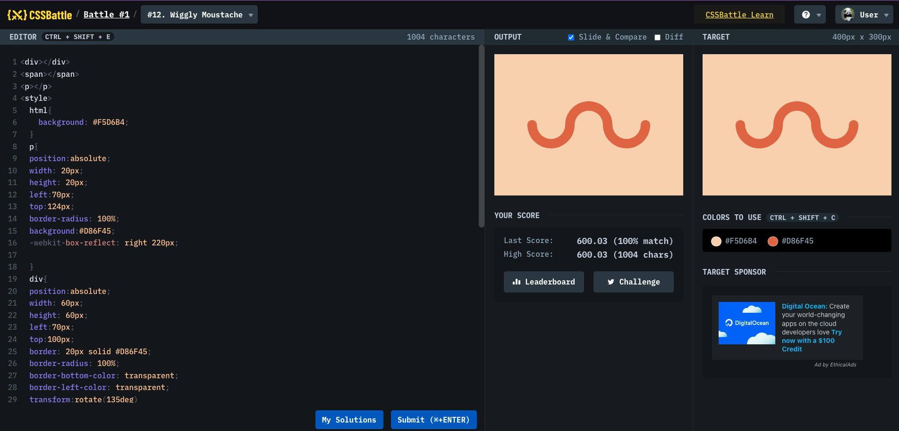

# Battle #1 - Pilot Battle

## #12 - Wiggly Moustache

[Link to the problem](https://cssbattle.dev/play/12)



```html
<div></div>
<span></span>
<p></p>
<style>
  html {
    background: #f5d6b4;
  }
  p {
    position: absolute;
    width: 20px;
    height: 20px;
    left: 70px;
    top: 124px;
    border-radius: 100%;
    background: #d86f45;
    -webkit-box-reflect: right 220px;
  }
  div {
    position: absolute;
    width: 60px;
    height: 60px;
    left: 70px;
    top: 100px;
    border: 20px solid #d86f45;
    border-radius: 100%;
    border-bottom-color: transparent;
    border-left-color: transparent;
    transform: rotate(135deg);
  }
  span {
    position: absolute;
    width: 60px;
    height: 60px;
    left: 230px;
    top: 100px;
    border: 20px solid #d86f45;
    border-radius: 100%;
    border-bottom-color: transparent;
    border-left-color: transparent;
    transform: rotate(135deg);
  }

  html::before {
    content: "";
    position: absolute;
    width: 60px;
    height: 60px;
    left: 150px;
    top: 100px;
    border: 20px solid #d86f45;
    border-radius: 100%;
    border-bottom-color: transparent;
    border-left-color: transparent;
    transform: rotate(315deg);
  }
</style>
```
