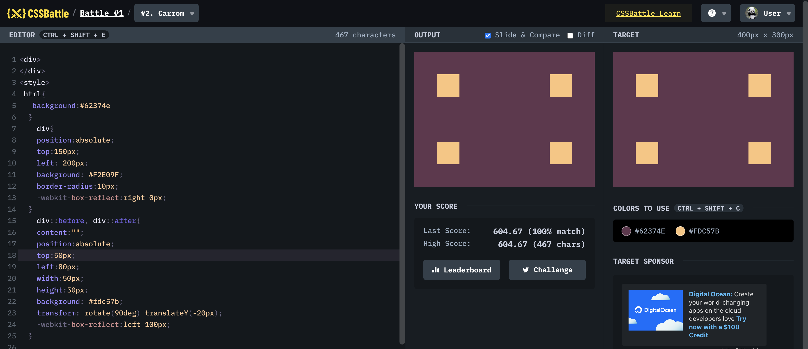

# Battle #1 - Pilot Battle

## #2 - Carrom

[Link to the problem](https://cssbattle.dev/play/2)



```html
<div>
</div>
<style>
 html{
   background:#62374e
  }
    div{
    position:absolute;
    top:150px;
    left: 200px;
    background: #F2E09F;
    border-radius:10px;
    -webkit-box-reflect:right 0px;
  }
    div::before, div::after{
    content:"";
    position:absolute;
    top:50px;
    left:80px;
    width:50px;
    height:50px;
    background: #fdc57b;
    transform: rotate(90deg) translateY(-20px);
    -webkit-box-reflect:left 100px;
  }
```
