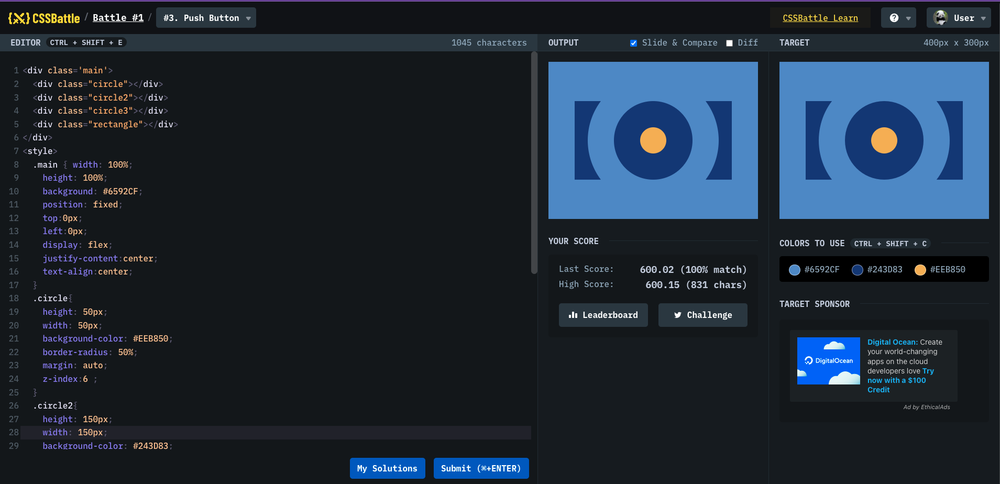

# Battle #1 - Pilot Battle

## #3 - Push Button

[Link to the problem](https://cssbattle.dev/play/3)



```html
<div class="main">
  <div class="circle"></div>
  <div class="circle2"></div>
  <div class="circle3"></div>
  <div class="rectangle"></div>
</div>
<style>
  .main {
    width: 100%;
    height: 100%;
    background: #6592cf;
    position: fixed;
    top: 0px;
    left: 0px;
    display: flex;
    justify-content: center;
    text-align: center;
  }
  .circle {
    height: 50px;
    width: 50px;
    background-color: #eeb850;
    border-radius: 50%;
    margin: auto;
    z-index: 6;
  }
  .circle2 {
    height: 150px;
    width: 150px;
    background-color: #243d83;
    border-radius: 50%;
    margin: auto;
    z-index: 5;
    position: absolute;
    top: 25%;
  }
  .circle3 {
    height: 250px;
    width: 250px;
    background-color: #6592cf;
    border-radius: 50%;
    margin: auto;
    z-index: 4;
    position: absolute;
    top: 25px;
  }
  .rectangle {
    z-index: 1;
    background-color: #243d83;
    height: 150px;
    width: 300px;
    position: absolute;
    margin: auto;
    top: 75px;
  }
</style>
```
