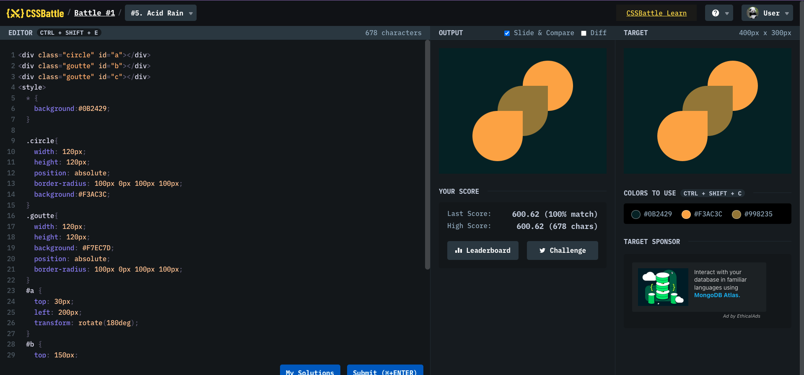

# Battle #1 - Pilot Battle

## #5 - Acid Rain

[Link to the problem](https://cssbattle.dev/play/5)



```html
<div class="circle" id="a"></div>
<div class="goutte" id="b"></div>
<div class="goutte" id="c"></div>
<style>
  * {
    background: #0b2429;
  }

  .circle {
    width: 120px;
    height: 120px;
    position: absolute;
    border-radius: 100px 0px 100px 100px;
    background: #f3ac3c;
  }
  .goutte {
    width: 120px;
    height: 120px;
    background: #f7ec7d;
    position: absolute;
    border-radius: 100px 0px 100px 100px;
  }
  #a {
    top: 30px;
    left: 200px;
    transform: rotate(180deg);
  }
  #b {
    top: 150px;
    left: 80px;
    background: #f3ac3c;
    z-index: 4;
  }
  #c {
    top: 90px;
    left: 140px;
    background: #998235;
    z-index: 3;
  }
</style>
```
