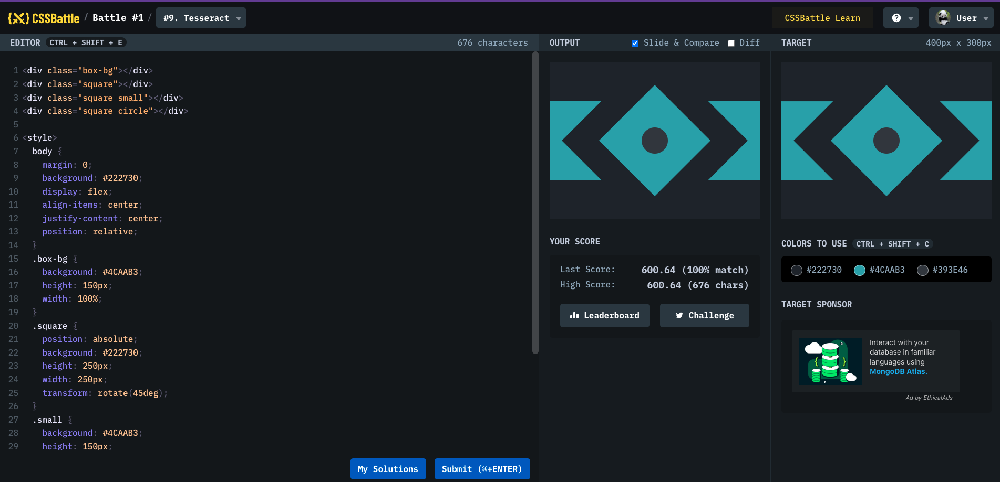

# Battle #1 - Pilot Battle

## #9 - Tesseract

[Link to the problem](https://cssbattle.dev/play/9)



```html
<div class="box-bg"></div>
<div class="square"></div>
<div class="square small"></div>
<div class="square circle"></div>

<style>
  body {
    margin: 0;
    background: #222730;
    display: flex;
    align-items: center;
    justify-content: center;
    position: relative;
  }
  .box-bg {
    background: #4caab3;
    height: 150px;
    width: 100%;
  }
  .square {
    position: absolute;
    background: #222730;
    height: 250px;
    width: 250px;
    transform: rotate(45deg);
  }
  .small {
    background: #4caab3;
    height: 150px;
    width: 150px;
  }
  .circle {
    background: #393e46;
    height: 50px;
    width: 50px;
    border-radius: 50%;
  }
</style>
```
