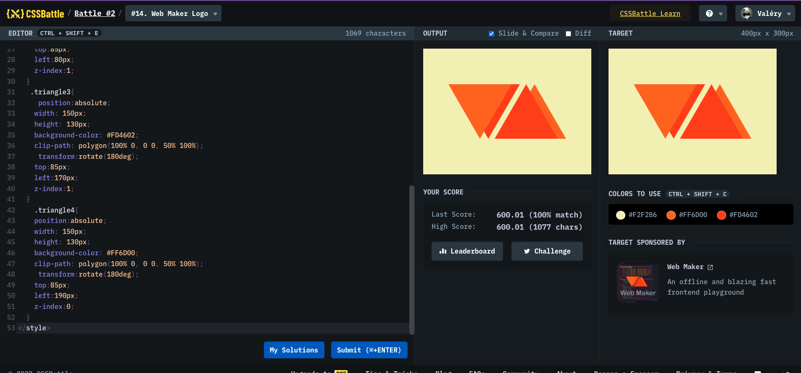

# Battle #2 - Visibility

## #14 - Web Maker Logo

[Link to the problem](https://cssbattle.dev/play/14)



```html
<div class="triangle"></div>
<div class="triangle2"></div>
<div class="triangle3"></div>
<div class="triangle4"></div>
<style>
  html {
    background: #f2f2b6;
    z-index: 3;
  }
  .triangle {
    position: absolute;
    width: 150px;
    height: 130px;
    background-color: #ff6d00;
    clip-path: polygon(100% 0, 0 0, 50% 100%);
    top: 85px;
    left: 60px;
    z-index: 2;
  }

  .triangle2 {
    position: absolute;
    width: 150px;
    height: 130px;
    background-color: #fd4602;
    clip-path: polygon(100% 0, 0 0, 50% 100%);
    top: 85px;
    left: 80px;
    z-index: 1;
  }
  .triangle3 {
    position: absolute;
    width: 150px;
    height: 130px;
    background-color: #fd4602;
    clip-path: polygon(100% 0, 0 0, 50% 100%);
    transform: rotate(180deg);
    top: 85px;
    left: 170px;
    z-index: 1;
  }
  .triangle4 {
    position: absolute;
    width: 150px;
    height: 130px;
    background-color: #ff6d00;
    clip-path: polygon(100% 0, 0 0, 50% 100%);
    transform: rotate(180deg);
    top: 85px;
    left: 190px;
    z-index: 0;
  }
</style>
```
