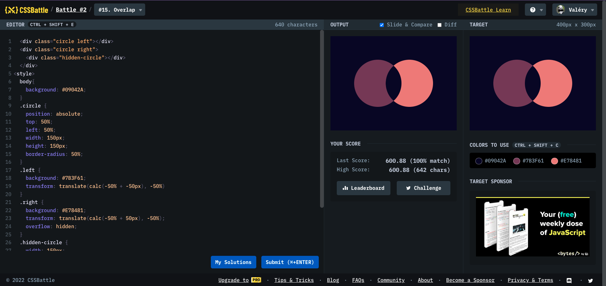

# Battle #2 - Visibility

## #15 - Overlap

[Link to the problem](https://cssbattle.dev/play/15)



```html
<div class="circle left"></div>
<div class="circle right">
  <div class="hidden-circle"></div>
</div>
<style>
  body {
    background: #09042a;
  }
  .circle {
    position: absolute;
    top: 50%;
    left: 50%;
    width: 150px;
    height: 150px;
    border-radius: 50%;
  }
  .left {
    background: #7b3f61;
    transform: translate(calc(-50% + -50px), -50%);
  }
  .right {
    background: #e78481;
    transform: translate(calc(-50% + 50px), -50%);
    overflow: hidden;
  }
  .hidden-circle {
    width: 150px;
    height: 150px;
    border-radius: 50%;
    background: #09042a;
    transform: translateX(-100px);
  }
</style>
```
