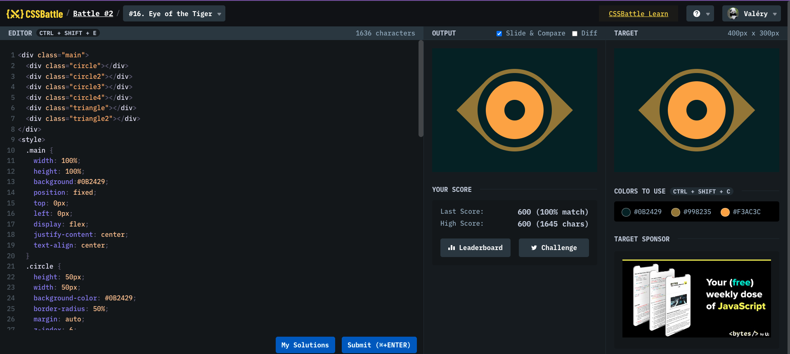

# Battle #2 - Visibility

## #16 - Eye_of_the_tiger

[Link to the problem](https://cssbattle.dev/play/16)



```html
<div class="main">
  <div class="circle"></div>
  <div class="circle2"></div>
  <div class="circle3"></div>
  <div class="circle4"></div>
  <div class="triangle"></div>
  <div class="triangle2"></div>
</div>
<style>
  .main {
    width: 100%;
    height: 100%;
    background: #0b2429;
    position: fixed;
    top: 0px;
    left: 0px;
    display: flex;
    justify-content: center;
    text-align: center;
  }
  .circle {
    height: 50px;
    width: 50px;
    background-color: #0b2429;
    border-radius: 50%;
    margin: auto;
    z-index: 6;
  }
  .circle2 {
    height: 140px;
    width: 140px;
    background-color: #f3ac3c;
    border-radius: 50%;
    margin: auto;
    z-index: 5;
    position: absolute;
    top: 80px;
  }
  .circle3 {
    height: 180px;
    width: 180px;
    background-color: #0b2429;
    border-radius: 50%;
    margin: auto;
    z-index: 4;
    position: absolute;
    top: 60px;
  }
  .circle4 {
    height: 200px;
    width: 200px;
    background-color: #998235;
    border-radius: 50%;
    margin: auto;
    z-index: 2;
    position: absolute;
    top: 50px;
  }
  .triangle {
    z-index: 1;
    position: absolute;
    margin: auto;
    top: 118px;
    left: 245px;
    border-color: transparent transparent #998235 transparent;
    border-style: solid;
    border-width: 0px 64px 64px 64px;
    transform: rotate(90deg);
  }
  .triangle2 {
    z-index: 1;
    position: absolute;
    margin: auto;
    top: 118px;
    left: 27px;
    border-color: transparent transparent #998235 transparent;
    border-style: solid;
    border-width: 0px 64px 64px 64px;
    transform: rotate(-90deg);
  }
</style>
```
