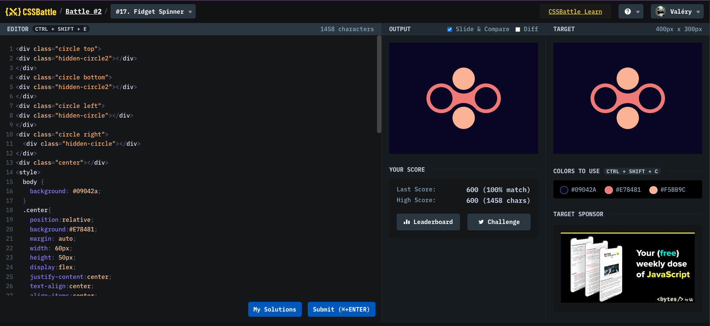

# Battle #2 - Visibility

## #17 - Fidget Spinner

[Link to the problem](https://cssbattle.dev/play/17)



```html
<div class="circle top">
  <div class="hidden-circle2"></div>
</div>
<div class="circle bottom">
  <div class="hidden-circle2"></div>
</div>
<div class="circle left">
  <div class="hidden-circle"></div>
</div>
<div class="circle right">
  <div class="hidden-circle"></div>
</div>
<div class="center"></div>
<style>
  body {
    background: #09042a;
  }
  .center {
    position: relative;
    background: #e78481;
    margin: auto;
    width: 60px;
    height: 50px;
    display: flex;
    justify-content: center;
    text-align: center;
    align-items: center;
    align-content: center;
    top: 118px;
  }
  .circle {
    position: absolute;
    top: 50%;
    left: 50%;
    width: 80px;
    height: 80px;
    border-radius: 50%;
  }
  .top {
    background: #09042a;
    transform: translate(calc(-50% + 0px), -116%);
    z-index: 2;
  }
  .bottom {
    background: #09042a;
    transform: translate(calc(-50% + 0px), 16%);
    z-index: 3;
  }
  .left {
    background: #e78481;
    transform: translate(calc(-50% + -60px), -50%);
  }
  .right {
    background: #e78481;
    transform: translate(calc(-150% + 140px), -50%);
    overflow: hidden;
  }
  .hidden-circle {
    width: 60px;
    height: 60px;
    border-radius: 50%;
    background: #09042a;
    transform: translateY(10px) translateX(10px);
  }
  .hidden-circle2 {
    width: 60px;
    height: 60px;
    border-radius: 50%;
    background: #f5bb9c;
    transform: translateY(10px) translateX(10px);
  }
</style>
```
