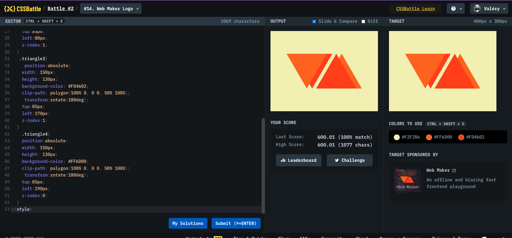

# Battle #2 - Visibility

## #14 - Web Maker Logo

[Link to the problem](https://cssbattle.dev/play/14)



```html
<div class="wrapper">
  <div class="triangle"></div>
  <div class="triangle"></div>
  <div class="triangle"></div>
  <div class="triangle"></div>
</div>
<style>
  body {
    background: #f2f2b6;
  }
  .wrapper {
    position: relative;
    width: 280px;
    height: 130px;
    margin: 85px auto;
  }
  .triangle {
    position: absolute;
    width: 0;
    height: 0;
    border-left: 75px solid transparent;
    border-right: 75px solid transparent;
    border-top: 130px solid #ff6d00;
    z-index: 1;
  }
  .triangle:nth-child(2) {
    border-top-color: #fd4602;
    left: 20px;
    z-index: 0;
  }
  .triangle:nth-child(3) {
    transform: scaleY(-1);
    border-top-color: #fd4602;
    left: 110px;
    z-index: 1;
  }
  .triangle:nth-child(4) {
    transform: scaleY(-1);
    left: 130px;
    z-index: 0;
  }
</style>
```
