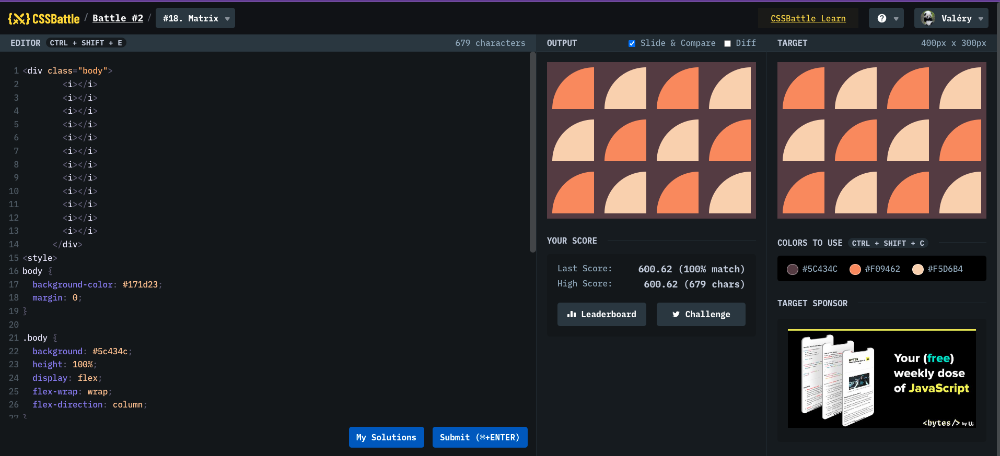

# Battle #2 - Visibility

## #18 - Matrix

[Link to the problem](https://cssbattle.dev/play/18)



```html
<div class="body">
  <i></i>
  <i></i>
  <i></i>
  <i></i>
  <i></i>
  <i></i>
  <i></i>
  <i></i>
  <i></i>
  <i></i>
  <i></i>
  <i></i>
</div>
<style>
  body {
    background-color: #171d23;
    margin: 0;
  }

  .body {
    background: #5c434c;
    height: 100%;
    display: flex;
    flex-wrap: wrap;
    flex-direction: column;
  }

  i {
    margin: 10px;
    width: 80px;
    height: 80px;
    overflow: hidden;
    position: relative;
  }

  i:before {
    content: "";
    border-radius: 50%;
    background: #f09462;
    width: 160px;
    height: 160px;
    position: absolute;
  }

  i:nth-child(2n):before {
    background: #f5d6b4;
  }
</style>
```
