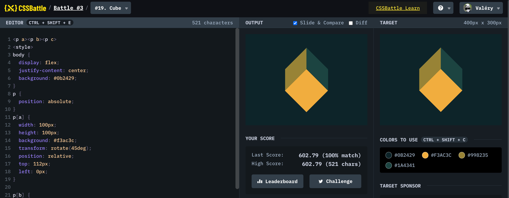

# Battle #3 - Visibility

## #19 - Cube

[Link to the problem](https://cssbattle.dev/play/19)



```html
<div class="square"></div>
<div class="diamond-narrow"></div>
<div class="diamond-narrow2"></div>
<div class="diamond-narrow3"></div>
<div class="diamond-narrow4"></div>
<style>
  html{
    width: 100%;
    height: 100%;
    background:#0B2429;
  }

	.diamond-narrow {
  width: 0;
  height: 0;
  border-bottom: 70px solid #998235;
  border-left: 70px solid transparent;
  position: absolute;
  top: 45px;
  left: 130px;
}

.diamond-narrow2 {
  position: absolute;
  width: 0;
  height: 0;
  border-top: 70px solid #998235;
  border-right: 70px solid transparent;
  top: 115px;
  left: 130px;
}

.diamond-narrow3 {
  position: absolute;
  width: 0;
  height: 0;
  border-right: 70px solid #1a4341;
  border-bottom: 70px solid transparent;
  top: 115px;
  left: 200px;
}

.diamond-narrow4 {
  position: absolute;
  width: 0;
  height: 0;
  border-left: 70px solid #1a4341;
  border-top: 70px solid transparent;
  top: 45px;
  left: 200px;
}

.square {
  width: 100px;
  height: 100px;
  background: #f3ac3c;
  transform: rotate(45deg);
  margin: 128px 142px;
  position: absolute;
}
</style>
```