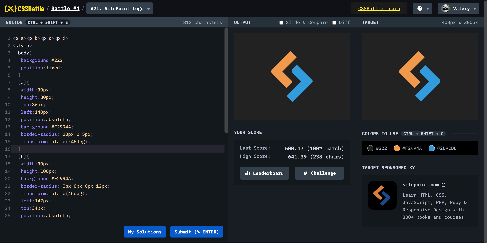

# Battle #3 - Visibility

## #21 - Site Point Logo

[Link to the problem](https://cssbattle.dev/play/21)



```html
<p a><p b><p c><p d>
<style> 		
  body{
   background:#222;
   position:fixed; 
  }
  [a]{
   width:30px;
   height:80px;
   top:86px;
   left:140px;
   position:absolute;
   background:#F2994A;
   border-radius: 10px 0 5px; 
   transform:rotate(-45deg);
  }
  [b]{
   width:30px;
   height:100px;
   background:#F2994A;
   border-radius: 0px 0px 0px 12px; 
   transform:rotate(45deg); 
   left:147px;
   top:34px;
   position:absolute;
   }
   [c]{
   width:30px;
   height:100px;
   background:#2D9CDB;
   border-radius: 0px 12px 0px 0px; 
   transform:rotate(45deg); 
   left:204px;
   top:118px;
   position:absolute;
   }
   [d]{
   width:30px;
   height:80px;
   top:84px;
   left:211px;
   position:absolute;
   background:#2D9CDB;
   border-radius: 10px 0 5px; 
   transform:rotate(-45deg);
  }
</style> 
```