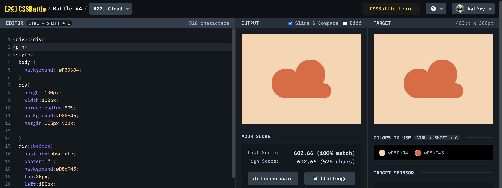

## #22 - Cloud

[Link to the problem](https://cssbattle.dev/play/22)



```html
<div></div>
<p b>
<style>
  body {
    background: #F5D6B4;
  }
  div{
    height:100px;
    width:100px;
    border-radius:50%;
    background:#D86F45;
 	  margin:115px 92px;
  }  
  div::before{
    position:absolute;
    content:"";
    background:#D86F45;
    top:85px;
    left:180px;
    height:100px;
    width:100px;
    border-radius:50%;
  }
  [b]{
    position:absolute;
    height:50px;
    width:150px;
    background:#D86F45;
    top:149px;
    right:100px;  
    border-radius:0px 50px 50px 0px;
  } 
</style>
```