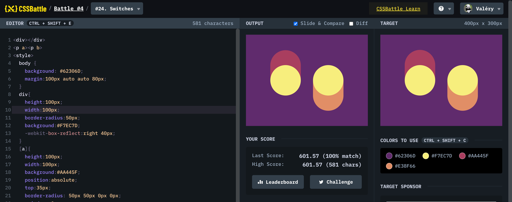

## #24 - Switches

[Link to the problem](https://cssbattle.dev/play/24)



```html
<div></div>
<p a><p b>
<style>
  body {
    background: #62306D;
    margin:100px auto auto 80px;
  }
  div{
    height:100px;
    width:100px;
    border-radius:50px;
    background:#F7EC7D;
    -webkit-box-reflect:right 40px;
  }
  [a]{
    height:100px;
    width:100px;
    background:#AA445F;
    position:absolute;
    top:35px;
    border-radius: 50px 50px 0px 0px;
    z-index:-2;=
  }
   [b]{
    height:100px;
    width:100px;
    background:#E38F66;
    position:absolute;
    top:134px;
    right:80px;
    border-radius: 0px 0px 50px 50px;
    z-index:-2;
  }
</style>
```