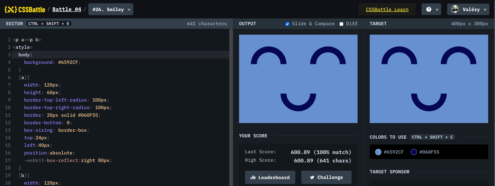

## #26 - Smiley

[Link to the problem](https://cssbattle.dev/play/26)



```html
<p a><p b>
<style>
  body{
    background: #6592CF;
  }
  [a]{
    width: 120px;
    height: 60px; 
    border-top-left-radius: 100px;
    border-top-right-radius: 100px;
    border: 20px solid #060F55;
    border-bottom: 0;
    box-sizing: border-box;
    top:24px;
    left:40px;
    position:absolute;
    -webkit-box-reflect:right 80px;
  } 
  [b]{
    width: 120px;
    height: 60px; 
    border-top-left-radius: 100px;
    border-top-right-radius: 100px;
    border: 20px solid #060F55;
    border-bottom: 0;
    box-sizing: border-box;
    top:184px;
    left:140px;
    position:absolute;
    transform:rotate(-180deg)
  } 
</style>
```