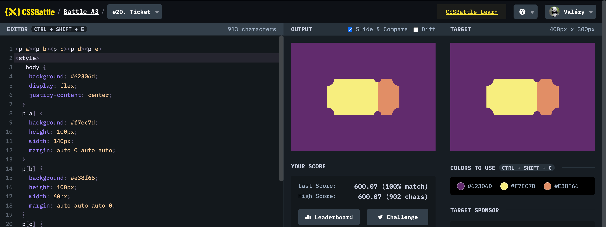

# Battle #3 - Cursor

## #20 - Ticket

[Link to the problem](https://cssbattle.dev/play/20)



```html
<p a><p b><p c><p d><p e> 
<style>
   body {
    background: #62306d;
    display: flex;
    justify-content: center;
  }
  p[a] {
    background: #f7ec7d;
    height: 100px;
    width: 140px;
    margin: auto 0 auto auto;
  }
  p[b] {
    background: #e38f66;
    height: 100px;
    width: 60px;
    margin: auto auto auto 0;
  }
  p[c] {
    position: absolute;
    border-radius: 20px;
    width: 50px;
    height: 50px;
    background: #62306d;
    top: 54px;
    left: 70px;
    -webkit-box-reflect: right 160px;
  }
  p[d] {
    position: absolute;
    border-radius: 20px;
    width: 50px;
    height: 50px;
    background: #62306d;
    top: 164px;
    left: 70px;
    -webkit-box-reflect: right 160px;
  }
  p[e] {
    position: absolute;
    border-radius: 50px;
    width: 20px;
    height: 20px;
    background: #62306d;
    top: 74px;
    left: 230px;
    -webkit-box-reflect: below 80px;
  }
  </style>
  ```