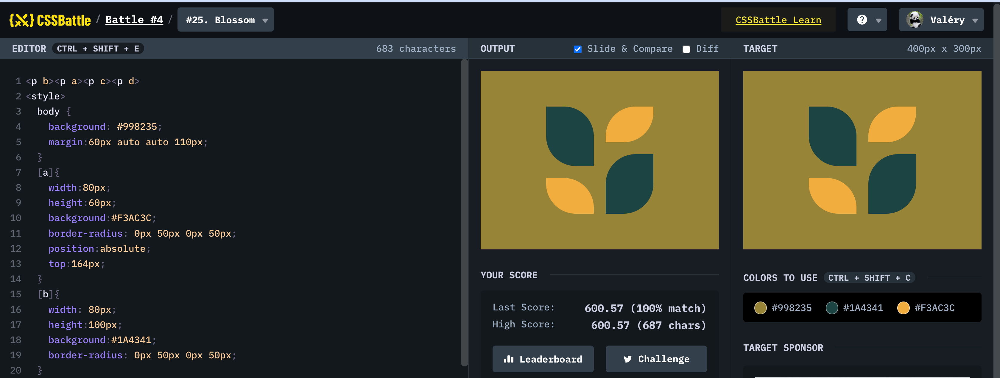

# Battle #4 - Display

## #25 - Blossom

[Link to the problem](https://cssbattle.dev/play/25)



```html
<p b><p a><p c><p d>
<style>
  body {
    background: #998235;
    margin:60px auto auto 110px;
  }
  [a]{
    width:80px;
    height:60px;
    background:#F3AC3C;
    border-radius: 0px 50px 0px 50px;
    position:absolute;
    top:164px;
  }
  [b]{
    width: 80px;
    height:100px;
    background:#1A4341;
    border-radius: 0px 50px 0px 50px;
  }
  [c]{
    width: 80px;
    height:100px;
    background:#1A4341;
    border-radius: 50px 0px 50px 0px;
    top:124px;
    right:110px;
    position:absolute;
  }
  [d]{
    width:80px;
    height:60px;
    background:#F3AC3C;
    border-radius: 50px 0px 50px 0px;
    position:absolute;
    top:44px;
    right:110px;
  }
</style>
```