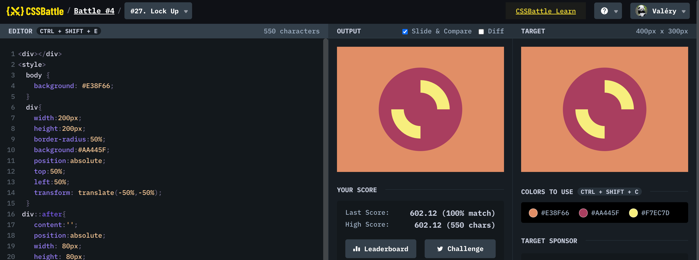

# Battle #4 - Display

## #27 - Lock up

[Link to the problem](https://cssbattle.dev/play/27)



```html
<div></div>
<style>
  body{
    background: #E38F66;
  }
  div{
    width:200px;
    height:200px; 
    border-radius:50%;
    background:#AA445F;
    position:absolute;
    top:50%;
    left:50%;
    transform: translate(-50%,-50%);
  }
 div::after{
    content:'';
    position:absolute;
    width: 80px;
    height: 80px;
    top:50%;
    left:50%;
    transform: translate(-50%,-50%) rotate(-45deg);
    border :30px solid #F7EC7D;
    border-radius: 50%;
    border-top-color: transparent;  
    border-bottom-color: transparent;      
  }
</style>
```