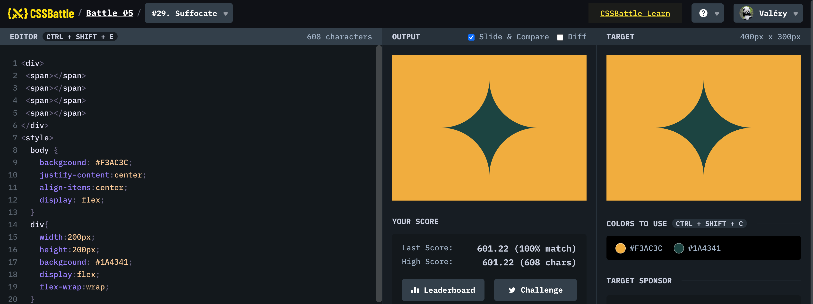

# Battle #5 - Inline

## #29 - Suffocate

[Link to the problem](https://cssbattle.dev/play/29)



```html
<div>
 <span></span>
 <span></span>
 <span></span>
 <span></span>
</div>
<style>
  body {
    background: #F3AC3C;
    justify-content:center;
    align-items:center;
    display: flex;
  }
  div{
    width:200px;
    height:200px;
    background: #1A4341;
    display:flex;
    flex-wrap:wrap;
  }
  span{
    background:#F3AC3C;
    width:50%;
    height:50%;
  }
  span:nth-of-type(1){
    border-radius:0 0 100px 0;
  }
  span:nth-of-type(2){
    border-radius:0 0 0px 100px;
  }
  span:nth-of-type(3){
    border-radius:0 100px 0 0;
  }
  span:nth-of-type(4){
    border-radius:100px 0 0 0;
  }
</style>
```