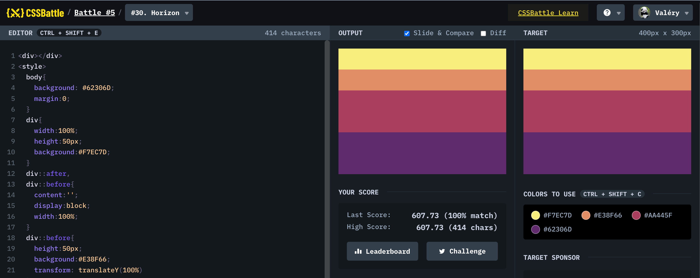

# Battle #5 - Inline

## #30 - Horizon

[Link to the problem](https://cssbattle.dev/play/30)



```html
<div></div>
<style>
  body{
    background: #62306D;
    margin:0;
  }
  div{
    width:100%;
    height:50px;
    background:#F7EC7D;
  }
  div::after,
  div::before{
    content:'';
    display:block;
    width:100%;
  }
  div::before{
    height:50px;
    background:#E38F66;
    transform: translateY(100%)
  }
  div::after{
    height:100px;
    background:#AA445F;
    transform: translateY(50%)
  }
</style>
```