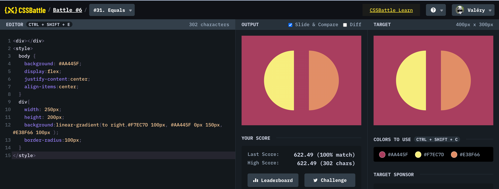

# Battle #6 - Conic

## #31 - Equals

[Link to the problem](https://cssbattle.dev/play/31)



```html
<div></div>
<style>
  body {
    background: #AA445F;
    display:flex;
    justify-content:center;
    align-items:center;
  }
  div{
    width: 250px;
    height: 200px; 
    background:linear-gradient(to right,#F7EC7D 100px, #AA445F 0px 150px, #E38F66 100px );
    border-radius:100px;  
  }
</style>
```