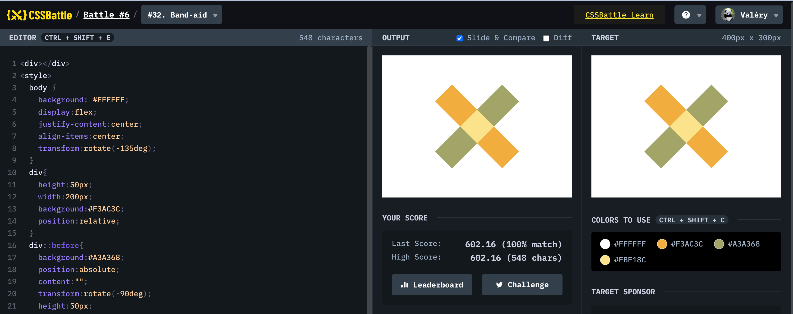

# Battle #6 - Conic

## #32 - Band-aid

[Link to the problem](https://cssbattle.dev/play/32)



```html
<div></div>
<style>
  body {
    background: #FFFFFF;
    display:flex;
    justify-content:center;
    align-items:center;
    transform:rotate(-135deg);
  }
  div{
    height:50px;
    width:200px;
    background:#F3AC3C;
    position:relative;
  }
  div::before{
    background:#A3A368;
    position:absolute;
    content:"";
    transform:rotate(-90deg);
    height:50px;
    width:200px;
  }
  div::after{
    background:#FBE18C;
    height:50px;
    width:50px;
    top:0%;
    left:37.5%;
    position:absolute;
    content:"";
  } 
</style>
```