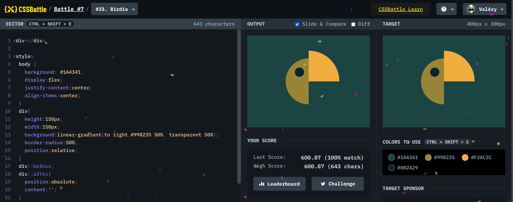

# Battle #7 - Backface

## #33 - Birdie

[Link to the problem](https://cssbattle.dev/play/33)



```html
<div></div>
<style>
  body {
    background: #1A4341;
    display:flex;
    justify-content:center;
    align-items:center;
  }
  div{
    height:150px;
    width:150px;
    background:linear-gradient(to right,#998235 50%, transparent 50%);
    border-radius:50%;
    position:relative;
  }
  div::before,
  div::after{
    position:absolute;
    content:'';
  }
  div::before{
    width:30px;
    height:30px;
    background:#0B2429;
    border-radius:50%;
    top:30px;
    left:30px;
  }
  div::after{
    width:100px;
    height:100px;
    background:#F3AC3C;
    border-radius: 0 100px 0 0;
    right:-25px;
    top:-25px;
  }
</style>
```