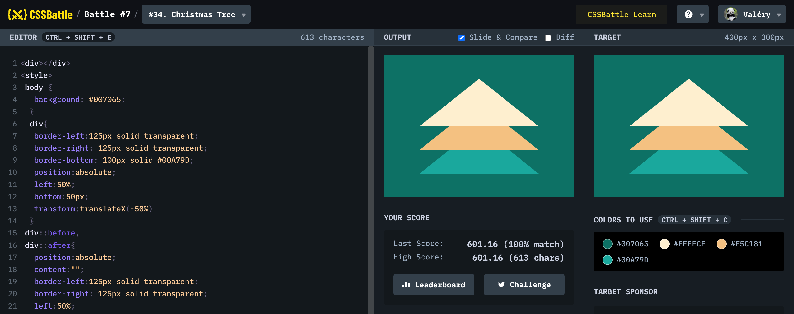

# Battle #7 - Backface

## #34 - Christmas tree

[Link to the problem](https://cssbattle.dev/play/34)



```html
<div></div>
<style>
 body {
   background: #007065;
  }
  div{ 
   border-left:125px solid transparent;
   border-right: 125px solid transparent;
   border-bottom: 100px solid #00A79D;
   position:absolute;
   left:50%; 
   bottom:50px;
   transform:translateX(-50%)
  }
 div::before, 
 div::after{
   position:absolute;
   content:"";
   border-left:125px solid transparent;
   border-right: 125px solid transparent;
   left:50%;
   transform:translateX(-50%)
  }
 div:before{
   top:-50px;
   border-bottom: 100px solid #F5C181;
  }
 div:after{
   top:-100px;
   border-bottom: 100px solid #FFEECF;
  }
</style>
```